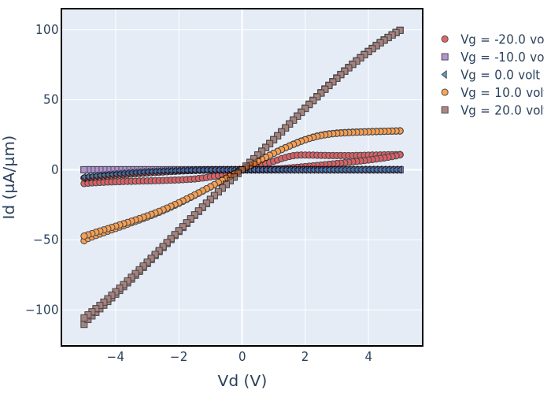
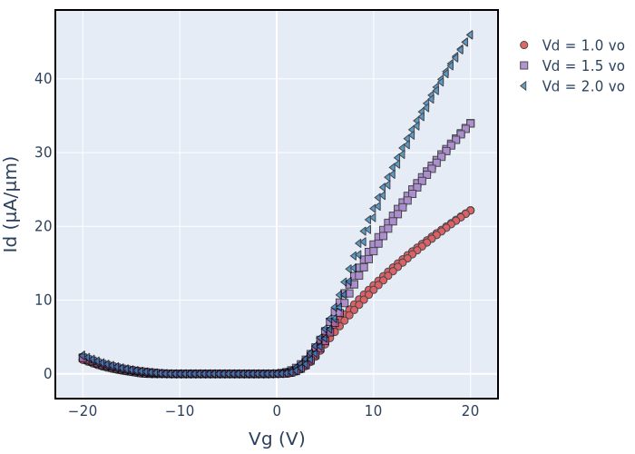
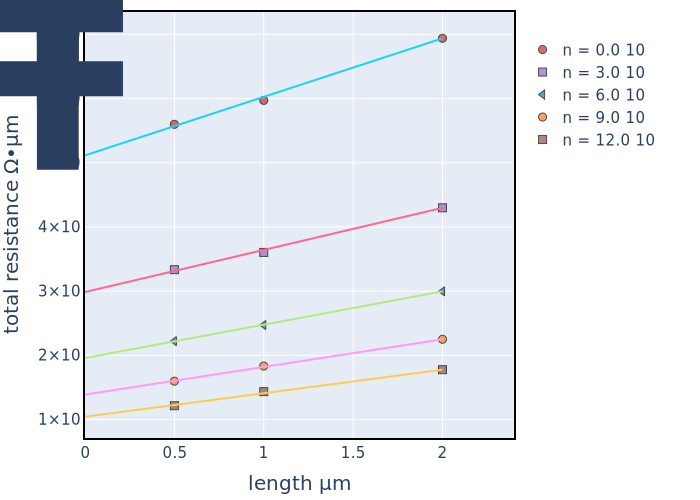
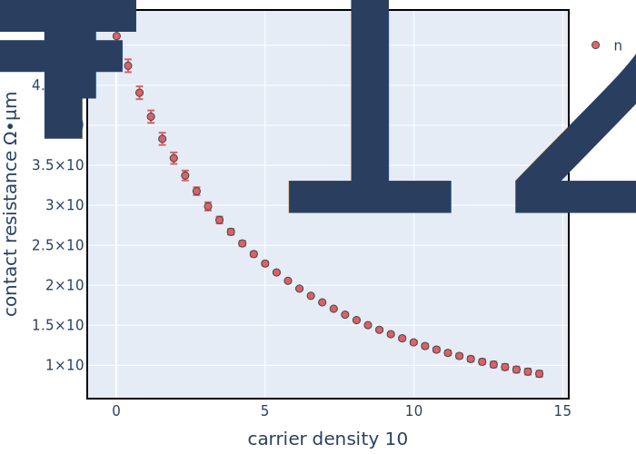
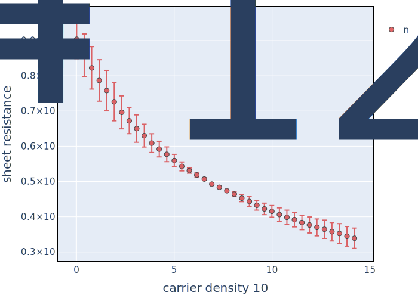

.. SemiPy documentation master file, created by
   sphinx-quickstart on Mon Mar  2 12:01:25 2020.
   You can adapt this file completely to your liking, but it should at least
   contain the root `toctree` directive.

==========
 Examples
==========

Analyzing 2D FET IdVd and IdVg Data
-----------------------------------

Below is a simple example of analyzing Id-Vg data of a 2D semiconductor transistor.

.. code-block:: python

   from SemiPy.Extractors.Transistor.FETExtractor import FETExtractor
   from physics.value import Value, ureg

   idvd_path = './WSe2_Sample_4_Id_Vd.txt'
   idvg_path = './WSe2_Sample_4_Id_Vg.txt'

   # create the FET extractor
   FET = FETExtractor(width=Value(1, ureg.micrometer), length=Value(1, ureg.micrometer),
                      tox=Value(30, ureg.nanometer), epiox=3.9, device_polarity='n',
                      idvg_path=idvg_path, idvd_path=idvd_path)

   FET.save_plots()

Calling :code:`FET.save_plots()` will then save the IdVd and IdVg data plots

.. csv-table:: Extracted FET Properties
   :file: basedevice.csv
   :header-rows: 1

Analyzing TLM Data
------------------

Below is a simple example of analyzing TLM data of a 2D semiconductor.

.. code-block:: python

   from SemiPy.Extractors.TLM.TLMExtractor import TLMExtractor
   from physics.value import Value, ureg

   idvg_path = './TLMExampleData'

   widths = Value(4.0, ureg.micrometer)
   lengths = Value.array_like(np.array([1.0, 0.5, 2.0]), unit=ureg.micrometer)
   tox = Value(90, ureg.nanometer)

   TLM = TLMExtractor(widths=widths, lengths=lengths, tox=tox, epiox=3.9,
                        device_polarity='n', idvg_path=idvg_path, vd_values=[1.0, 2.0])

   TLM.save_tlm_plots()

Calling :code:`TLM.save_plots()` will then save the IdVd and IdVg data plots

